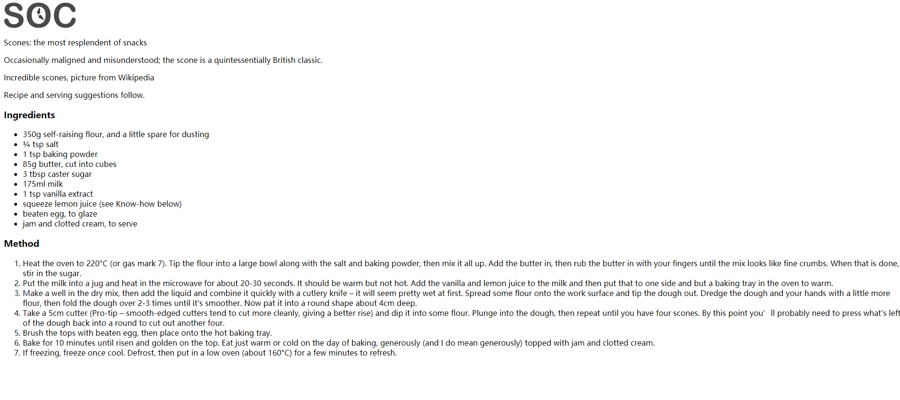
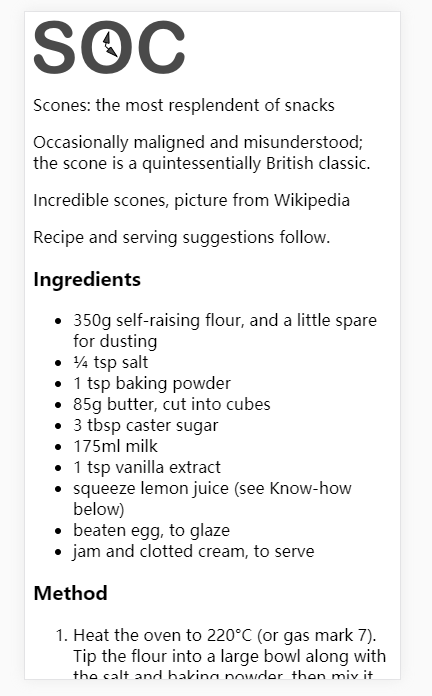

# 响应式web设计

## 一、初识响应式

### 1.1 什么是响应式设计

> 响应式网站设计是一种网络页面设计布局，其理念是：集中创建页面的图片排版大小，可以智能地根据用户行为以及使用的设备环境进行相对应的布局。

此概念于2010年5月由国外著名网页设计师Ethan Marcotte所提出。

响应式网站设计(Responsive Web design)的理念是：

页面的设计与开发应当根据用户行为以及设备环境(系统平台、屏幕尺寸、屏幕定向等)进行相应的响应和调整。

### 1.2 第一个响应式例子

#### 1.2.1 视口

默认情况下，网页布局是有弹性的。我们缩放浏览器窗口，你会看见文本会根据屏幕缩放自动进行重排。

我们将一个网页分别在pc和iPhone状态下查看：

**PC:**



**iphone:**


可以发现，在iPhone中也是一个正常的网页。这是因为ios默认会按照980像素宽度来渲染页面，然后再把页面缩小呈现在**视口**当中。

> 浏览器中用于呈现网页的区域叫做视口(viewport)。视口通常并不等于屏幕大小，特别是可以缩放浏览器窗口的情况下。

#### 1.2.2 加上meta标签

我们在页面`head`中加入一个meta标签：

```html
<meta name="viewport" content="width=device-width">
```

加入以上meta标签，它告诉浏览器怎么渲染网页：按照设备的宽度(device-width) 来渲染内容。

我们刷新看iPhone视口的状态：



现在iPhone手机状态下的文字看起来更加自然原生。

### 1.3 图片的处理

这个时候我们如果直接向页面插入一个2000px的图片，回导致整个页面都失衡。

我们可以使用`max-wdith`属性来给我们的图片设置宽度

```css
img {
    max-width: 100%;
}
```

刷新页面，我们看到页面比较符合我们预期：


**为什么不用`width:100%`?**

`max-width`: 保证图片最大显示为自身的100%，即最大只可以显示自身原有的宽度。此时如果包含图片元素比图片本身宽度小，图片会自动等比例缩放沾满最大可用空间。
如果使用`widht:100%`，那么图片就不会考虑自身的宽度，直接显示为容器宽度一样宽，图片很可能被无谓的拉伸。

### 1.4 媒体查询

上面的网页案例虽然在手机端效果很好，但是当我们调到大视口的时候，我们会发现由于图片太大的原因使得我们的页面在大视口下表现的很差(图片太大影响体验)


当视口宽度超过600px的时候，页面显示效果就变得越来越差了。针对这一情况，我们可以使用CSS3的**媒体查询**，根据屏幕的宽度来调整布局。媒体查询可以让我们在某些条件下（制定的宽或高）为网页应用样式。

#### 1.4.1 根据自己项目设置断点

**断点：**就是某个宽度临界点，超过这个点布局就会发生显著的变化。

刚开始使用媒体查询的时候，开发者经常会针对当前流行的设备进行断点设置，比如iPhone和iPad的宽度决定断点。其实这是不可取的，我们的断点设置应该根据自己的项目的内容和设计本身所决定。

#### 1.4.2 最小宽度媒体查询

我们这里先来通过最小宽度媒体查询，来简单认识一下媒体查询。

最小宽度可以使用不同的单位设定，比如百分比，em，rem，px

```css
@media screen and (min-width: 50em) {
    /* 样式 */
}
```

`@media`指令告诉浏览器这是一个媒体查询，`screen`告诉浏览器这里的规则只适用于屏幕类型，而`and (min-width: 50em)`的意思是其中的规则只适用于视口宽度在50em以上的情况。


## 二、媒体查询

### 2.1 为什么需要媒体查询


### 2.2 媒体查询的语法


### 2.3 媒体查询在`link` ,`@import` ,`CSS文件`中的使用


2.4 